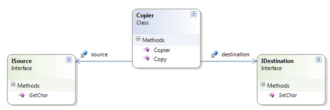

# :paperclip: Character Copy Kata :paperclip:

[](https://python.org)

## Resources

These instructions where extracted from Urls Enzler blog. The link to the original instructions can be found in the link bellow.

[](https://www.planetgeek.ch/2010/03/31/mocking-kata-copier-net/)

## Description

The character copier is a simple class that reads characters from a source and copies them to a destination one character at a time.

The character copier gets the source and destination injected in the constructor.



When the method Copy is called on the copier then it should read characters from the source and copy them to the destination until the
source returns a newline (‘\n’).

The exercise is to implement the character copier using mocks for the source and the destination (try using manually written mocks and
mocks written with a mocking framework.

## Objective

The objective of the kata is to practice Mocking and Stubs to test a class without depending on other classes.

We will try to work with the concept of baby steps and compare manually writen mocks with mocks written with a mocking framework.

## Configuration

The project can be configured with `poetry` and `pyenv`.

1. Install python version with pyenv:
    ```bash
    pyenv install 3.12.0
    ```
2. Install poetry:
    ```bash
    pip install poetry
    ```
3. Create a virtual environment and install dependencies:
    ```bash
    poetry install
    poetry install --dev
    ```

   By default, it will create the virtual environment outside the project. To create it inside, use the following command:
    ```bash
    poetry config virtualenvs.in-project true
    poetry install
    ```
4. Activate the virtual environment:
   ```bash
    poetry shell
    ```
   You can activate it manually running `source .venv/bin/activate` on Unix systems or `source .venv/Scripts/activate` on Windows.

## Running the tests

To run the tests, execute one of the following commands:

```bash
pytest
```

or

```bash
poetry run pytest
```

## Learnings

1. The Open/Closed principle was not being followed. It would be difficult to add new types of alarms without modifying the Alarm class.
2. It was difficult to test the Alarm class because it was tightly coupled to the Sensor class.
3. We've learned how to use Stubs and Mocks to test a class without depending on other classes.

### Visit my GitHub profile to see all solved katas 🚀

[](https://github.com/dimanu-py/code-katas)
